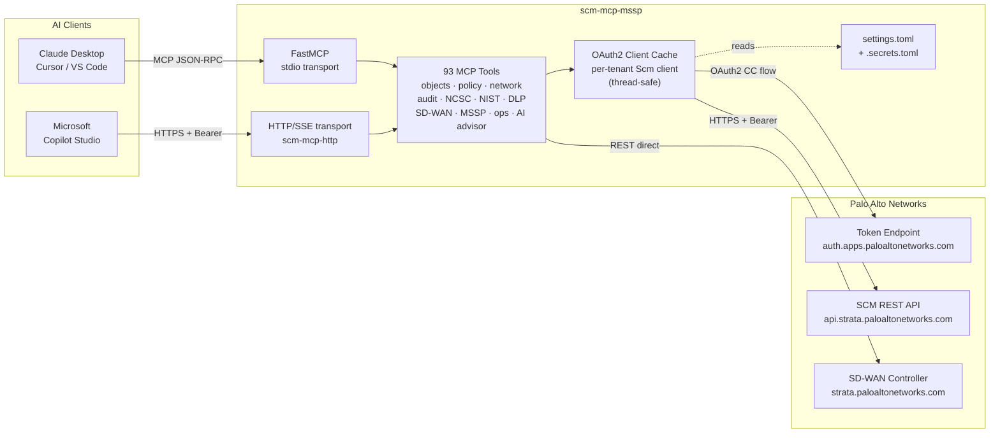
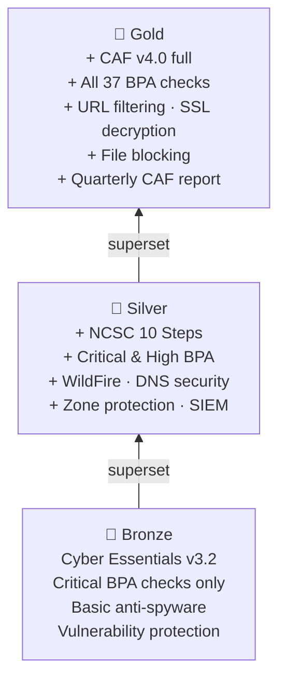
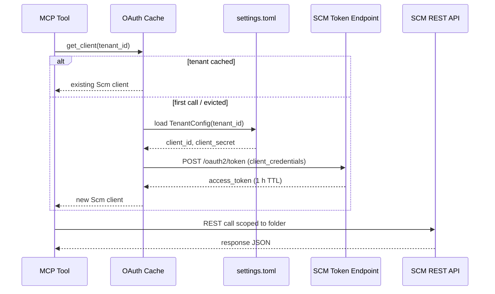
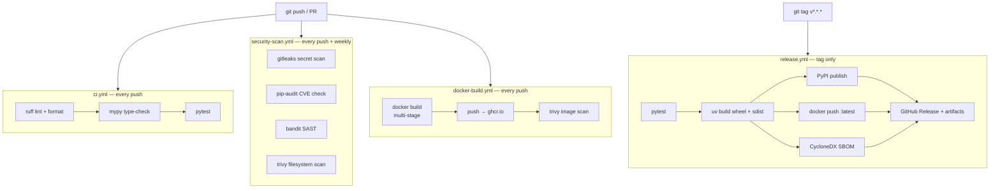

# scm-mcp-mssp

[](https://github.com/silverbacksecurity/scm-mcp-mssp/actions/workflows/ci.yml)
[](https://github.com/silverbacksecurity/scm-mcp-mssp/actions/workflows/security-scan.yml)
[](https://github.com/silverbacksecurity/scm-mcp-mssp/actions/workflows/docker-build.yml)
[](https://pypi.org/project/scm-mcp-mssp/)
[](https://www.python.org/downloads/)
[](LICENSE)

MCP (Model Context Protocol) server for **Palo Alto Networks Strata Cloud Manager (SCM)**, built for Managed Security Service Providers. Exposes 85 SCM operations as MCP tools consumable by Claude Desktop, Cursor, Copilot Studio, or any MCP-compatible AI assistant.

---

## Disclaimer

This is a personal, community-driven open-source project maintained by the author independently. It is **not** an official Palo Alto Networks product, feature, or tool, and it is **not** supported or endorsed by Palo Alto Networks in any way. All opinions, configurations, and examples are the author's own and do not represent the views of any employer. Use this software at your own risk. Provided "as is", without warranty of any kind.

---

## Quick start

```bash
git clone https://github.com/silverbacksecurity/scm-mcp-mssp
cd scm-mcp-mssp
uv sync
cp .env.example .env          # fill in your SCM credentials
uv run scm-mcp                # starts stdio transport for Claude Desktop
```

Then ask Claude:

> *"Run a BPA assessment on my Prisma Access config and give me a prioritised remediation plan"*

> *"Generate a full AS-IS AS-BUILT document for this tenant"*

> *"Check NCSC compliance and apply the baseline security profiles"*

> *"Show me the SD-WAN VPN overlay topology as a diagram"*

---

## What it does

| Capability | Description |
|-----------|-------------|
| **Config management** | Read/write address objects, security rules, NAT, zones, VPN tunnels, remote networks |
| **Config backup & diff** | Export full snapshots to JSON; compare pre/post change-window |
| **Config clone** | Clone a golden-config backup to a new folder or tenant with PSK sanitisation |
| **BPA assessment** | 39 Palo Alto Best Practice checks scored against live config |
| **NCSC compliance** | CAF v4.0, Cyber Essentials v3.2, 10 Steps, NSF — gap analysis + auto-remediation |
| **NIST compliance** | NIST CSF v2.0 / SP 800-53 Rev 5 gap analysis and snippet creation |
| **NCSC/NIST baseline snippets** | Create reusable SCM snippets with compliant security profiles for mass deployment |
| **AS-IS AS-BUILT report** | Generates a Markdown or Word AS-BUILT document from live config with Mermaid diagrams |
| **AI compliance advisor** | Claude-powered executive summary + remediation playbook from NCSC/NIST gap findings |
| **SD-WAN topology** | Queries the Prisma SD-WAN controller for VPN overlay maps and link health |
| **Enterprise DLP** | List, backup, and restore Enterprise DLP patterns and SCM data-filtering profiles |
| **MSSP tier management** | Gold / Silver / Bronze scoring, onboarding snippets, upgrade path analysis |
| **Licensing & telemetry** | Subscription licence inventory, mobile user stats, job audit history |
| **CASB / ZTNA / Browser / AIRS** | Inventory SaaS restrictions, ZTNA connectors, Prisma Browser, and AI Runtime Security |
| **Operational visibility** | Certificate expiry scanner, licence forecast, SPN bandwidth allocation vs branch count, live GP/PA-Agent session count by country and compute node |
| **MSSP NOC dashboard** | Single-call traffic-light health view across all tenants: rules, RNs, tunnels, nearest licence expiry |
| **Multi-tenant** | Thread-safe per-tenant client cache; credentials from `settings.toml` |
| **HTTP/SSE transport** | Copilot Studio and browser-based MCP clients via `scm-mcp-http` |

---

## System architecture



---

## Installation

### Prerequisites

- Python 3.12+
- [`uv`](https://docs.astral.sh/uv/)
- PAN Strata Cloud Manager access with an OAuth2 service account

Obtain credentials from: **PAN Customer Support Portal → Strata Cloud Manager → API Keys**

### Install

```bash
git clone https://github.com/silverbacksecurity/scm-mcp-mssp
cd scm-mcp-mssp
uv sync
```

---

## Configuration

### Single-tenant (quickstart)

```bash
cp .env.example .env
```

```dotenv
SCM_MCP_SCM_TENANT_ID=your-tsg-id
SCM_MCP_SCM_CLIENT_ID=your-client-id@iam.panserviceaccount.com
SCM_MCP_SCM_CLIENT_SECRET=your-client-secret
SCM_MCP_SCM_DEFAULT_FOLDER=Prisma Access
```

### MSSP multi-tenant

```bash
cp settings.example.toml settings.toml
```

**`settings.toml`** (git-ignored — tenant IDs and labels identify your customers, keep it local):
```toml
[default]
mssp_mode = true

[tenants.acme-corp]
tenant_id          = "tsg-id-for-acme"
client_id          = "svc-acme@iam.panserviceaccount.com"
default_folder     = "Acme-Corp"
label              = "Acme Corp"
tier               = "gold"
service_term_years = 3
account_ref        = "CRM-12345"
```

**`.secrets.toml`** (never commit — git-ignored):
```toml
[tenants.acme-corp]
client_secret = "..."
```

---

## Usage

### Claude Desktop

Add to `~/.config/Claude/claude_desktop_config.json`:

```json
{
  "mcpServers": {
    "scm-mcp-mssp": {
      "command": "uv",
      "args": ["run", "--directory", "/path/to/scm-mcp-mssp", "scm-mcp"]
    }
  }
}
```

Restart Claude Desktop. The server registers as 95 tools in Cowork mode.

### Cursor / VS Code

Add to `.cursor/mcp.json` or `.vscode/mcp.json`:

```json
{
  "servers": {
    "scm-mcp-mssp": {
      "type": "stdio",
      "command": "uv",
      "args": ["run", "--directory", "/path/to/scm-mcp-mssp", "scm-mcp"]
    }
  }
}
```

### Microsoft Copilot Studio (HTTP/SSE)

```bash
# Generate a secure API key
export SCM_MCP_HTTP_API_KEY=$(python -c "import secrets; print(secrets.token_urlsafe(32))")

# Start the HTTP server
uv run scm-mcp-http
# Listening on 0.0.0.0:8080
```

In Copilot Studio: **Settings → AI → MCP Servers → Add server**
- **Server URL:** `https://your-host/sse`
- **Authentication:** Custom header → `X-API-Key: <your-key>`

For Entra ID auth (production):
```bash
export SCM_MCP_HTTP_AUTH_MODE=entra
export SCM_MCP_HTTP_ENTRA_TENANT=your-tenant-id
export SCM_MCP_HTTP_ENTRA_AUDIENCE=your-app-registration-client-id
uv run scm-mcp-http
```

### Docker

```bash
docker build -t scm-mcp-mssp .

# stdio transport
docker run -i --env-file .env scm-mcp-mssp

# HTTP/SSE transport
docker run -p 8080:8080 \
  -e SCM_MCP_HTTP_API_KEY=your-key \
  -e SCM_MCP_HTTP_AUTH_MODE=apikey \
  --env-file .env \
  scm-mcp-mssp scm-mcp-http
```

---

## Example workflows

### BPA assessment and remediation plan

```
Run a BPA assessment on folder "Prisma Access" and give me a prioritised
remediation plan, focusing on critical and high findings first.
```

```
Generate the full BPA report and save it to a file.
```

```
Show me only the critical and high BPA failures with remediation steps.
```

### NCSC compliance

```
Check NCSC compliance gaps for folder "Prisma Access" against
CAF v4.0 and Cyber Essentials v3.2.
```

```
Apply the NCSC baseline security profiles to "Prisma Access".
```

```
Auto-attach the NCSC profiles to all allow rules in "Prisma Access".
```

The NCSC workflow typically runs in three steps:

```
1. scm_ncsc_gap(folder="Prisma Access")          → identify gaps
2. scm_apply_ncsc_baseline(folder="Prisma Access", dry_run=False)
                                                  → create baseline objects
3. scm_attach_ncsc_profiles(folder="Prisma Access", dry_run=False)
                                                  → attach to all allow rules
```

### NIST compliance

```
Run a NIST CSF v2.0 gap analysis on folder "Prisma Access".
```

```
Create a NIST-compliant SCM snippet for reuse across new customer folders.
```

```
Give me an AI-generated executive summary of our NIST compliance gaps and a
prioritised remediation playbook.
```

### AS-IS AS-BUILT report

```
Generate a full AS-IS AS-BUILT report for this tenant and save it as a Word document.
```

```
Generate the AS-BUILT report with live SD-WAN data included.
```

The report includes:
- Mermaid topology diagrams (enterprise RA, Prisma Access routing, SD-WAN dual-hub)
- Remote network WAN IP/IKE details table
- Security policy summary
- SD-WAN VPN overlay topology (if SD-WAN licensed)
- Licensing overview
- NCSC / BPA compliance status
- PAN reference architecture doc links
- Full appendix with 18 reference documents

### Config backup and diff

```
Take a config backup of folder "Prisma Access" before the change window.
```

```
Compare the pre-change and post-change snapshots and show what changed.
```

```
Clone the config from folder "Golden-Template" to "Acme-Corp".
```

### SD-WAN topology

```
Show me the SD-WAN VPN overlay topology diagram.
```

```
List all SD-WAN sites and their WAN interfaces.
```

```
Which SD-WAN sites have inactive or degraded WAN links?
```

### Enterprise DLP

```
List all Enterprise DLP data patterns and inline SCM DLP profiles.
```

```
Export a full DLP config backup for this tenant.
```

```
Restore the DLP backup to the staging tenant (dry-run first).
```

### Operational visibility

```
Scan all certificate objects for expiry — show anything expiring in the next 90 days.
```

```
Show the licence forecast for all tenants — which are approaching seat capacity?
```

```
Show the NOC dashboard with a traffic-light health summary for all tenants.
```

```
How many GlobalProtect and Prisma Access Agent users are currently connected?
Show a breakdown by country and GP version.
```

```
What's the SPN bandwidth allocation vs branch count for all Prisma Access SPNs?
Is any SPN oversubscribed?
```

### SDK and server management

```
Check whether pan-scm-sdk, prisma-sase, and the MCP library are up to date.
```

```
Are there any recent changes to the Palo Alto pan.dev SASE API docs?
```

```
Restart the MCP server to pick up the latest code changes.
```

### MSSP operations

```
Show me a dashboard of all loaded tenants and their compliance scores.
```

```
Run a tier assessment for Acme Corp against their Gold service level.
```

```
What does Acme Corp need to move from Silver to Gold tier?
```

```
List all tenants, their auth status, and which licences are expiring soonest.
```

---

## MCP tools reference

### Object management

| Tool | Description |
|------|-------------|
| `scm_address_list` | List address objects in a folder |
| `scm_address_get` | Fetch a single address object by name |
| `scm_address_create` | Create an address object (ip_netmask / fqdn / ip_range) |
| `scm_address_delete` | Delete an address object |
| `scm_address_group_list` | List address groups |
| `scm_service_list` | List service objects |
| `scm_tag_list` | List tags |
| `scm_edl_list` | List external dynamic lists |

### Security policy

| Tool | Description |
|------|-------------|
| `scm_security_rule_list` | List security rules (pre / post position) |
| `scm_security_rule_get` | Fetch a single security rule by name |
| `scm_security_rule_create` | Create a security rule |
| `scm_security_rule_delete` | Delete a security rule |
| `scm_anti_spyware_profile_list` | List anti-spyware profiles |
| `scm_url_category_list` | List URL categories |

### Network

| Tool | Description |
|------|-------------|
| `scm_zone_list` | List security zones |
| `scm_nat_rule_list` | List NAT rules |
| `scm_nat_rule_get` | Fetch a single NAT rule |
| `scm_ike_gateway_list` | List IKE gateways |
| `scm_ipsec_tunnel_list` | List IPSec tunnels |
| `scm_dns_server_list` | List DNS server profiles |

### Deployment

| Tool | Description |
|------|-------------|
| `scm_remote_network_list` | List remote networks (branch / SD-WAN sites) |
| `scm_remote_network_get` | Fetch a single remote network with WAN IP details |
| `scm_service_connection_list` | List service connections |
| `scm_bandwidth_allocation_list` | List Prisma Access bandwidth allocations |
| `scm_commit` | Commit candidate config (synchronous, 300 s timeout) |
| `scm_job_status` | Poll an async SCM job by ID |
| `scm_list_jobs` | List recent commit/push jobs with user, type, result, and timestamps |

### Audit and compliance

| Tool | Description |
|------|-------------|
| `scm_config_backup` | Export full config snapshot to timestamped JSON |
| `scm_config_clone` | Clone config from one folder to another |
| `scm_config_diff` | Diff two backup JSON snapshots by resource type |
| `scm_bpa_assess` | Run 39 PAN BPA checks; filterable by severity / category |
| `scm_aiops_bpa` | Submit PAN-OS XML to AIOps BPA API; parse scores + findings |
| `scm_incident_search` | Search SCM security incidents; filter by severity/status/product |
| `scm_incident_summary` | Cross-tenant NOC incident dashboard (counts by severity per tenant) |
| `scm_posture_report` | Retrieve Posture Management best-practice report (requires add-on licence) |
| `scm_adnsr_list` | List ADNSR profiles, internal-domains, connection sources, etc. |
| `scm_adnsr_profile_create` | Create an ADNSR DNS security profile (requires ADNSR licence) |
| `scm_ngfw_local_config_list` | List config versions pushed to an SCM-managed NGFW device |
| `scm_ngfw_local_config_get` | Fetch NGFW local config XML for BPA or diff (requires NGFW Ops entitlement) |
| `scm_ncsc_assess` | Per-control NCSC compliance view; filterable by framework |
| `scm_dspt_assess` | NHS DSPT 2024-25 assessment (Standards 7–10); DSPT-portal-ready evidence |
| `scm_iso27001_assess` | ISO/IEC 27001:2022 Annex A assessment; 12 automatable controls; CONFORMING / NONCONFORMITY verdict |
| `scm_decrypt_policy_audit` | Deep-dive SSL/TLS decryption audit: profile quality, rule coverage, gaps (NCSC D3.b / DSPT 9) |
| `scm_audit_report` | Combined BPA + NCSC Markdown / JSON report |
| `scm_asbuilt_report` | Full AS-IS AS-BUILT document (Markdown + optional docx) |

### NCSC baseline

| Tool | Description |
|------|-------------|
| `scm_ncsc_gap` | Gap analysis: maps live config against CAF v4.0 / CE v3.2 / 10 Steps |
| `scm_nist_gap` | Gap analysis: maps live config against NIST CSF v2.0 / SP 800-53 Rev 5 |
| `scm_apply_ncsc_baseline` | Create NCSC-compliant profile set and deny-all rule in a folder |
| `scm_create_ncsc_snippet` | Create a reusable SCM snippet containing NCSC-compliant security profiles |
| `scm_create_nist_snippet` | Create a reusable SCM snippet containing NIST-compliant security profiles |
| `scm_attach_ncsc_profiles` | Create NCSC-Baseline profile group and attach it to all allow rules |

**NCSC baseline objects created** (`scm_apply_ncsc_baseline` / `scm_create_ncsc_snippet`):

| Object | Type | NCSC control |
|--------|------|-------------|
| `NCSC-Baseline-AntiSpyware` | Anti-spyware profile | CAF C5 / CE Malware — cloud inline + MICA C2 detectors |
| `NCSC-Baseline-Vulnerability` | Vulnerability profile | CE Patch — block critical/high CVEs |
| `NCSC-Baseline-WildFire` | WildFire AV profile | CE Malware — all file types, public cloud |
| `NCSC-Baseline-URL` | URL access profile | CE / 10 Steps — block C2/malware/phishing |
| `NCSC-Baseline-Logging` | Log forwarding profile | CAF C5 — traffic/threat/wildfire/url/auth → Cortex |
| `NCSC-Deny-All` | Security rule | CAF C3 — explicit deny with log_end=True |
| `NCSC-Compliant` | Tag | Inventory / CMDB tagging |
| `NCSC-Baseline` | Profile group | Groups the four profiles for rule attachment |

**NIST baseline objects created** (`scm_create_nist_snippet`):

| Object | Type | NIST control |
|--------|------|-------------|
| `NIST-Baseline-AntiSpyware` | Anti-spyware profile | SP 800-53 SI-3 / SI-4 — C2 detection, critical+high block |
| `NIST-Baseline-Vulnerability` | Vulnerability profile | SP 800-53 SI-2 / RA-5 — block critical/high CVEs |
| `NIST-Baseline-WildFire` | WildFire AV profile | SP 800-53 SI-3 / SP 800-171 3.14 — all files |
| `NIST-Baseline-URL` | URL access profile | CSF PR.AC-5 / SC-7 — block C2/malware/phishing |
| `NIST-Baseline-Logging` | Log forwarding profile | SP 800-53 AU-2 / AU-12 — audit logging |
| `NIST-Compliant` | Tag | Inventory tagging |

### SD-WAN

| Tool | Description |
|------|-------------|
| `sdwan_list_sites` | List all Prisma SD-WAN sites |
| `sdwan_list_elements` | List ION devices / elements |
| `sdwan_list_wan_interfaces` | List WAN interfaces per site |
| `sdwan_list_wan_networks` | List WAN network definitions |
| `sdwan_list_clusters` | List SD-WAN hub clusters |
| `sdwan_list_path_groups` | List path groups |
| `sdwan_list_policies` | List SD-WAN policies |
| `sdwan_list_bgp` | List BGP peer configurations |
| `sdwan_topology` | Fetch raw VPN overlay topology data |
| `sdwan_topology_diagram` | Generate Mermaid VPN overlay diagram with link health status |
| `sdwan_debug_topology` | Return raw topology API JSON for a site (development / troubleshooting) |

### Enterprise DLP

| Tool | Description |
|------|-------------|
| `dlp_enterprise_list` | List Enterprise DLP data patterns and ML-based profiles from `api.dlp.paloaltonetworks.com` |
| `dlp_backup` | Export SCM inline DLP and Enterprise DLP config as a JSON backup |
| `dlp_restore` | Restore a DLP backup to a target tenant/folder (dry-run by default) |

### AI compliance advisor

| Tool | Description |
|------|-------------|
| `scm_ai_compliance_advisor` | Run NCSC/NIST gap checks then generate an executive summary and remediation playbook via Claude |

### Setup and MSSP

| Tool | Description |
|------|-------------|
| `scm_folder_list` | List SCM folders (customer hierarchy) |
| `scm_folder_get` | Fetch a single folder |
| `scm_device_list` | List onboarded devices |
| `scm_snippet_list` | List configuration snippets |
| `mssp_list_tenants` | List all loaded tenant IDs and auth status |
| `mssp_evict_tenant` | Evict a cached client (force re-auth after credential rotation) |
| `mssp_tier_assess` | Score a folder against its contracted tier (Bronze / Silver / Gold) |
| `mssp_tier_report` | Customer-facing Markdown compliance report with remediation |
| `mssp_upgrade_path` | Gap analysis: what's needed to move between tiers |
| `mssp_onboard_tenant` | Apply tier snippets to a new customer folder (dry-run by default) |
| `mssp_tenant_dashboard` | Summary of all loaded tenants with compliance scores |
| `mssp_snippet_catalogue` | Content specifications for all tier SCM snippets |
| `mssp_tier_comparison` | Side-by-side Gold / Silver / Bronze feature comparison |
| `scm_license_info` | List Prisma SASE subscription licences with SKU, seats, and expiry |
| `scm_mobile_user_stats` | Live Prisma Access mobile user allocation and connected user count |
| `scm_dlp_list` | List SCM inline DLP data-filtering profiles and data objects |
| `scm_casb_list` | List CASB SaaS tenant restriction policies |
| `scm_ztna_connector_list` | List ZTNA Connector infrastructure (connectors and groups) |
| `scm_browser_list` | List Prisma Browser device/user/application group configuration |
| `scm_ngfw_device_list` | List NGFW managed devices onboarded to Strata Cloud Manager |
| `scm_airs_list` | List Prisma AIRS (AI Runtime Security) configuration and profiles |

### Operational visibility

| Tool | Description |
|------|-------------|
| `scm_cert_scan` | Scan all certificate objects across folders, flag expiring within N days (default 90) with CRITICAL/WARNING/CAUTION/OK status |
| `scm_licence_forecast` | Licence expiry and seat utilisation per tenant; `all_tenants=True` scans every MSSP tenant in one call |
| `scm_tenant_dashboard` | NOC wallboard: rules, remote networks, tunnels, nearest licence expiry, and RAG status for every MSSP tenant |
| `scm_spn_bandwidth` | SPN bandwidth allocation vs branch count; per-branch Mbps share and oversubscription risk (HIGH/MEDIUM/LOW) |
| `scm_gp_session_summary` | Live GP + Prisma Access Agent session count by country, compute node, and client version; compares against licensed MU seat capacity. No usernames — aggregate counts only |

### Utility

| Tool | Description |
|------|-------------|
| `scm_check_updates` | Check PyPI + GitHub for latest SDK and pan.dev SASE API updates |
| `scm_restart` | Schedule a clean SIGTERM so Claude Desktop or a supervisor can auto-reconnect |
| `scm_reload` | Hot-reload scm_mcp_mssp source modules without restarting the MCP server |

---

## MCP resources

| URI | Description |
|-----|-------------|
| `scm://tenants` | Index of all loaded tenants |
| `scm://tenants/{tenant_id}` | Authentication status for a tenant |
| `scm://tenants/{tenant_id}/folders` | SCM folder list for a tenant |

---

## Service tiers

Tiers map commercial service packages to security requirements. Each tier is a strict superset of the one below — a Gold-compliant customer is always also Bronze and Silver compliant.

| Feature | 🥉 Bronze | 🥈 Silver | 🥇 Gold |
|---------|-----------|-----------|---------|
| NCSC framework | CE v3.2 | CE v3.2 + 10 Steps | CAF v4.0 (full) |
| BPA checks required | Critical only | Critical + High | All (incl. Medium/Low) |
| Anti-spyware | Basic | With DNS sinkholing | With DNS sinkholing |
| Vulnerability protection | ✅ | ✅ | ✅ |
| WildFire analysis | ❌ | ✅ | ✅ |
| DNS security profiles | ❌ | ✅ | ✅ |
| URL filtering | ❌ | ❌ | ✅ |
| File blocking | ❌ | ❌ | ✅ |
| SSL/TLS decryption | ❌ | ❌ | ✅ |
| Zone protection profiles | ❌ | ✅ | ✅ |
| Log forwarding / SIEM | ❌ | ✅ | ✅ |
| Compliance reporting | CE baseline | CE Plus | CAF v4.0 quarterly |



---

## BPA checks

39 checks across nine categories, each cross-referenced to NCSC controls:

| Category | Check IDs | Example checks |
|----------|-----------|----------------|
| Security Rules | SR-001–008 | No-profile allow rules, any-any permit, deny-all terminator, unrestricted outbound |
| Threat Prevention | TP-001–006 | Anti-spyware + DNS sinkholing, WildFire, vulnerability profiles, file blocking, decryption |
| URL Filtering | URL-001 | URL categories configured |
| Zone Protection | ZP-001 | Zones with protection profiles |
| Logging | LOG-001–003 | Log forwarding profiles, syslog, per-rule attachment |
| Network | NET-001–002 | Zone segmentation, remote network IPSec |

---

## NCSC controls

Findings cross-reference 16 controls across four frameworks:

| Framework | Controls |
|-----------|----------|
| NCSC CAF v4.0 (Aug 2025) | B2.a/b/c, B3.a/b, B4.a, C1.a/b |
| Cyber Essentials v3.2 | CE-FW-1, CE-FW-2, CE-FW-3, CE-FW-4 |
| NCSC 10 Steps | 10S-NS-1/2/3, 10S-TP-1 |
| Network Security Fundamentals | NSF-ZT-1, NSF-LOG-1 |

---

## Architecture

### Multi-tenant request flow



### Source layout

```
src/scm_mcp_mssp/
├── server.py              # FastMCP entry point; tool/resource registration
├── server_http.py         # HTTP/SSE transport (Copilot Studio)
├── config/
│   └── settings.py        # Pydantic-settings; TenantConfig with tier fields
├── auth/
│   └── oauth.py           # Thread-safe per-tenant Scm client cache
├── tools/
│   ├── objects.py         # Address, service, tag, EDL
│   ├── security.py        # Security rules, anti-spyware, URL category
│   ├── network.py         # Zone, NAT, IKE/IPSec, DNS
│   ├── deployment.py      # Remote network, service connection, commit, job list
│   ├── setup.py           # Folder, device, snippet, MSSP tenant
│   ├── audit.py           # Backup, BPA, NCSC, AS-BUILT report, diff, clone
│   ├── ncsc_baseline.py   # NCSC/NIST gap analysis, baseline apply, snippets
│   ├── sdwan.py           # SD-WAN topology, sites, elements, policies
│   ├── mssp.py            # Tier assessment, onboarding, licensing, CASB/DLP/ZTNA/Browser/AIRS
│   ├── dlp.py             # Enterprise DLP list, backup, restore
│   ├── ai_advisor.py      # AI-powered compliance advisor (Claude)
│   └── reload.py          # Hot-reload source modules without restart
├── audit/
│   ├── models.py          # AuditSnapshot, Finding, Severity, Status
│   ├── extractor.py       # Pulls 30+ resource types from SCM SDK
│   ├── bpa_checks.py      # 39 BPA check functions
│   ├── ncsc_controls.py   # NCSC control catalogue + BPA→NCSC mapping
│   ├── ncsc_templates.py  # NCSC-compliant config object templates
│   ├── tiers.py           # Gold/Silver/Bronze definitions + scoring
│   ├── asbuilt_report.py      # AS-BUILT Markdown builder
│   ├── pan_references.py  # PAN reference architecture doc library
│   ├── sdwan_topo.py      # SD-WAN VPN overlay topology builder
│   └── report.py          # BPA + NCSC Markdown / JSON report builder
├── resources/
│   └── tenant.py          # scm://tenants/* MCP resources
└── utils/
    ├── errors.py           # Exception hierarchy
    └── logging.py          # structlog JSON logging
```

---

## HTTP/SSE transport environment variables

| Variable | Default | Description |
|----------|---------|-------------|
| `SCM_MCP_HTTP_PORT` | `8080` | TCP port |
| `SCM_MCP_HTTP_AUTH_MODE` | `apikey` | `apikey` \| `entra` \| `none` |
| `SCM_MCP_HTTP_API_KEY` | — | Required for `apikey` mode |
| `SCM_MCP_HTTP_ALLOWED_ORIGINS` | `*` | CORS origins, comma-separated |
| `SCM_MCP_HTTP_ENTRA_TENANT` | — | Entra tenant ID (entra mode) |
| `SCM_MCP_HTTP_ENTRA_AUDIENCE` | — | App registration client ID (entra mode) |

Health check endpoint (no auth): `GET /health` → `{"status": "ok"}`

---

## Development

```bash
uv sync                          # install all deps including dev
uv run pytest tests/unit/ -v     # run tests
uv run ruff check src/ tests/    # lint
uv run ruff format src/ tests/   # format
uv run mypy src/                 # type check
uv run pre-commit install        # install git hooks
```

### CI/CD



- `client_secret` is `SecretStr` throughout — never appears in logs or `repr()`
- `.env` and `.secrets.toml` are git-ignored
- `detect-private-key` pre-commit hook is installed
- `no-commit-to-branch` hook prevents direct commits to `master`

---

## References

- [pan-scm-sdk](https://github.com/cdot65/pan-scm-sdk) — Python SDK for SCM (v0.15.0+)
- [pan.dev SCM API](https://pan.dev/scm/) — Strata Cloud Manager API documentation
- [pan.dev SASE API](https://pan.dev/sase/) — Prisma SASE / SD-WAN API documentation
- [prisma-sase-sdk-python](https://github.com/PaloAltoNetworks/prisma-sase-sdk-python) — Prisma SASE Python SDK (v6.6.2b1+)
- [NCSC CAF v4.0](https://www.ncsc.gov.uk/collection/caf) — Cyber Assessment Framework
- [Cyber Essentials v3.2](https://www.ncsc.gov.uk/cyberessentials) — NCSC Cyber Essentials scheme
- [NCSC 10 Steps](https://www.ncsc.gov.uk/collection/10-steps) — 10 Steps to Cyber Security
- [NIST CSF v2.0](https://www.nist.gov/cyberframework) — NIST Cybersecurity Framework
- [NIST SP 800-53 Rev 5](https://csrc.nist.gov/publications/detail/sp/800-53/rev-5/final) — Security and Privacy Controls
- [Prisma Access SASE Deployment Guide](https://www.paloaltonetworks.com/resources/guides/sec-enterprise-connectivity-prisma-sdwan-deployment)

---

## Licence

Apache 2.0
