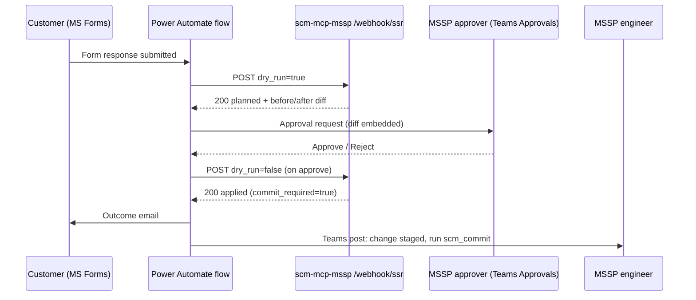

# SSR Intake — Power Automate Flow Design

Customer-facing intake for Simple Service Requests (SSRs), feeding the
`POST /webhook/ssr` endpoint on the HTTP server. Microsoft Forms captures the
request, Power Automate validates it, an Approvals step shows the dry-run diff
to an MSSP approver, and only an explicit approval triggers execution. Commit
stays a separate engineer-owned `scm_commit` step — the flow never commits.



## 1. Endpoint contract

`POST /webhook/ssr` (server_http.py). Sits behind the standard AuthMiddleware
(`X-API-Key` or Entra Bearer) **and** requires `SCM_MCP_HTTP_SSR_WEBHOOK=1` —
it is off by default because, unlike `/webhook/ir`, it can write (to
`ssr_objects`-allowlisted objects only).

Request body:

```json
{
  "operation": "url-allow-list | url-block-list | threat-exception | ssl-decrypt-exclude",
  "target": "example.com",
  "ticket_ref": "INC-12345",
  "action": "add | remove",
  "tenant_id": "<scm tenant id>",
  "folder": "",
  "dry_run": true,
  "requested_by": "user@customer.example"
}
```

`operation`, `target`, `ticket_ref` are required. `action` defaults to `add`,
`dry_run` to `true`. String booleans ("true"/"false") are accepted;
unrecognized `dry_run` values stay dry-run. `requested_by` is echoed into the
response and the structured log for provenance.

Responses:

| HTTP | Meaning | Flow handling |
|---|---|---|
| 200 | `status: planned` (dry-run diff) or `status: applied` | proceed |
| 400 | malformed request — missing fields, bad JSON | notify requester, stop |
| 401 | auth failure | ops alert — key rotation drift |
| 403 | webhook disabled (`SCM_MCP_HTTP_SSR_WEBHOOK` unset) | ops alert |
| 422 | SSR tool rejected it (bad target, no `ssr_objects` config, SCM error) | notify requester with `body.error` |

The 200 body carries `before`/`after` (the diff for the approval card),
`already_present`/`already_absent` (idempotent no-ops), and
`commit_required`.

## 2. Form design (Microsoft Forms)

One form **per customer tenant** — the flow hard-codes the `tenant_id`, so a
customer can never select another customer's tenant. Restrict the form to the
customer's guest users / the shared engagement group in Entra.

| # | Question | Type | Maps to |
|---|---|---|---|
| 1 | What change do you need? | Choice: "Allow a URL", "Block a URL", "Add a threat exception", "Exclude a category from SSL decryption" | `operation` |
| 2 | Add or remove? | Choice: Add / Remove | `action` |
| 3 | URL / threat ID / category name | Text, required | `target` |
| 4 | Your change or incident reference | Text, required | `ticket_ref` |
| 5 | Business justification | Text, long | approval card only |

Choice labels map to operation slugs in the flow (step 3 below) — customers
never see the API vocabulary. If no ITSM reference exists, drop question 4 and
generate `ticket_ref` in the flow (see §5).

## 3. Flow design (step by step)

**Connections:** Forms, Approvals, Teams, Outlook, HTTP. Store the API key in
Azure Key Vault and fetch it with the Key Vault connector; turn on **secure
inputs/outputs** on the HTTP actions so the key never lands in run history.

1. **Trigger** — Forms: *When a new response is submitted* (the tenant's form).
2. **Get response details** — Forms action, response ID from the trigger.
3. **Compose — map choices to slugs** — a `Select`/`if()` chain:
   - "Allow a URL" → `url-allow-list`, "Block a URL" → `url-block-list`,
     "Add a threat exception" → `threat-exception`,
     "Exclude a category from SSL decryption" → `ssl-decrypt-exclude`
   - "Add" → `add`, "Remove" → `remove`
4. **HTTP — dry run** — POST `https://<server>/webhook/ssr`, headers
   `X-API-Key` (from Key Vault) + `Content-Type: application/json`, body:

   ```json
   {
     "operation": "@{outputs('Compose_operation')}",
     "action": "@{outputs('Compose_action')}",
     "target": "@{trim(outputs('Get_response_details')?['body/r_target'])}",
     "ticket_ref": "@{outputs('Get_response_details')?['body/r_ticket']}",
     "tenant_id": "<hard-coded tenant id>",
     "dry_run": true,
     "requested_by": "@{outputs('Get_response_details')?['body/responder']}"
   }
   ```

5. **Condition — dry run accepted?** — `statusCode` equals 200.
   - **No →** *Send an email (V2)* to the requester quoting
     `body('HTTP_dry_run')?['error']`, then **Terminate (Succeeded)**. This
     catches invalid targets and idempotent surprises early, before anyone is
     asked to approve.
6. **Condition — no-op?** — `already_present` or `already_absent` is true →
   email the requester "already in the requested state, no change needed",
   terminate. Skipping approval for no-ops keeps the approver queue honest.
7. **Start and wait for an approval** — type *Approve/Reject — First to
   respond*; assigned to the MSSP ops approver group. Details (markdown):
   requester, tenant, operation/action/target, ticket_ref, justification, and
   the diff — `before`/`after` from the dry-run body (for URL lists, just the
   `list` arrays). Set the flow timeout (Settings on this action) to your SLA,
   e.g. `P2D`.
8. **Condition — approved?**
   - **Reject →** email requester with the approver's comments, terminate.
9. **HTTP — execute** — identical body to step 4 with `"dry_run": false`.
10. **Condition — applied?** — `statusCode` 200 and `body.status` = `applied`.
    - **No →** post to the MSSP ops Teams channel with the response body and
      the run link; email requester "queued for engineering review".
11. **Notify** —
    - Requester email: change applied, ticket_ref, awaiting config commit.
    - Teams post to the ops channel: *"SSR `<ticket_ref>` applied to
      `<tenant>` — `scm_commit` needed"*. Commit is deliberately human: the
      engineer reviews staged changes (possibly batching several SSRs) and
      commits via MCP/CLI.
12. **Error scaffold** — a parallel *Notify ops* branch with **Configure run
    after: has failed, has timed out** on the HTTP/approval actions, so
    transport failures and expired approvals page ops instead of dying
    silently.

Re-running a failed flow is safe end-to-end: `scm_ssr_execute` is idempotent,
so a retried execute returns `already_present` rather than double-applying.

## 4. Security notes

- **Two-phase by construction** — the form can only cause a dry-run; a write
  requires the Approvals step, and the approval identity (Entra) is in the
  flow run history for audit.
- **Blast radius** — the endpoint only reaches `ssr_objects`-allowlisted
  objects for the named tenant, never a rulebase, and never commits.
- **Key handling** — API key scoped to this flow, stored in Key Vault,
  secure-inputs on. Prefer `SCM_MCP_HTTP_AUTH_MODE=entra` once the server has
  an app registration; the HTTP action then uses a managed-identity token
  instead of a shared key.
- **Tenant pinning** — `tenant_id` is hard-coded per flow, never taken from
  form input.
- **Server side** — set `SCM_MCP_HTTP_SSR_WEBHOOK=1` only on deployments that
  actually serve this flow; every request logs operation, target, ticket_ref,
  requester, and dry_run as structured `ssr_webhook_processed` events.

## 5. ticket_ref strategy

The tool requires a `ticket_ref` and stamps it into object descriptions.
Preference order:

1. Customer supplies their ITSM reference on the form (§2 q4).
2. Flow-generated: `concat('SSR-', workflow()?['run']?['name'])` — unique per
   run and traceable back to the flow run history.
3. Best: replace Forms with a ServiceNow/JSM catalog item whose business rule
   POSTs the same payload — the ticket then exists before the change does.

## 6. Copilot Studio variant (optional)

The same server already speaks MCP over SSE for Copilot Studio. A
conversational intake ("please allow github.com") can be a Copilot Studio
agent topic that collects the same four slots and calls this flow (Power
Automate flows are directly invocable from topics). Keep the webhook + approval
flow as the single write path — the agent should fill the form, not gain its
own key.

## 7. Smoke test

```bash
export SCM_MCP_HTTP_SSR_WEBHOOK=1
uv run scm-mcp-http &

curl -s -X POST localhost:8080/webhook/ssr \
  -H "X-API-Key: $SCM_MCP_HTTP_API_KEY" -H 'Content-Type: application/json' \
  -d '{"operation":"url-allow-list","target":"example.com",
       "ticket_ref":"SSR-TEST-1","tenant_id":"<tenant>","dry_run":true}' | jq .status
# → "planned", with before/after diff in the body
```
